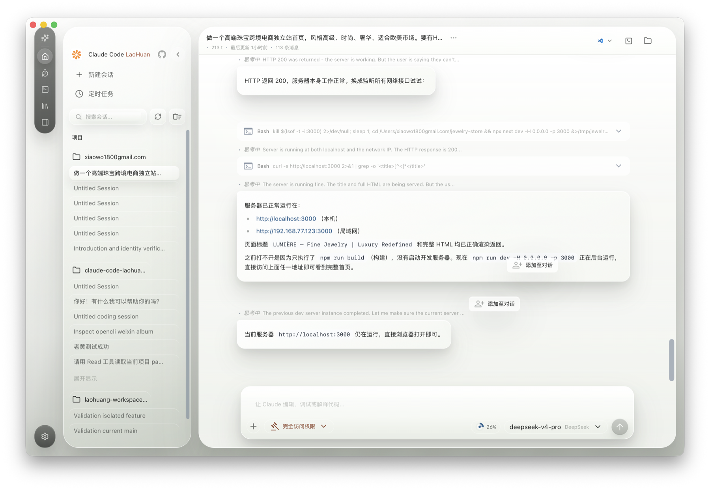

# Claude Code LaoHuang

<p align="right"><strong>中文</strong> | <a href="./README.en.md">English</a></p>

<p align="center">
  
</p>

<p align="center">
  <strong>Claude Code LaoHuang</strong><br>
  A locally runnable Claude Code desktop workspace.
</p>

Claude Code LaoHuang is a desktop AI coding workspace designed for local project development. It retains Claude Code's tool calling, project context, and multi-model integration capabilities, while providing a desktop interface better suited for daily use.

The current desktop version supports integration with Anthropic-compatible APIs and allows configuration of providers/models such as MiniMax, DeepSeek, OpenRouter, and others.

---

## Desktop Version Preview

Below is a real screenshot of the macOS desktop `.app` workspace. The interface includes a project sidebar, session list, chat area, tool call logs, permission modes, model selection, context usage meter, and a bottom input area.

<p align="center">
  
</p>

## Download Desktop Version

- [macOS Apple Silicon `.dmg`](https://github.com/Ai-LaoHuang/claude-code-laohuang/releases/download/v0.1.0/Claude-Code-LaoHuang_0.1.0_macos_arm64.dmg)
- [Windows x64 Installer `.exe`](https://github.com/Ai-LaoHuang/claude-code-laohuang/releases/download/v0.1.0/Claude-Code-LaoHuang_0.1.0_windows_x64_setup.exe)
- [v0.1.0 Release Page](https://github.com/Ai-LaoHuang/claude-code-laohuang/releases/tag/v0.1.0)

The macOS package is built natively for Apple Silicon and is not yet notarized; you may need to allow it in System Settings upon first launch.

macOS DMG SHA256:

```text
f1de4b9b1c8162898a4f26b4f922079242f42a1a99d10b9bf9764e821806f171
```

Windows Installer SHA256:

```text
eec6531c177106bdc1943d56b5cac08effa62bc4792407c808e646ed09419b9e
```

## Desktop Version Highlights

- Native Desktop Workspace: Sidebar for managing projects and history sessions, main area for long conversations and tool call results.
- Local Project Workflow: Open projects, launch terminals, display workspaces, and continue coding tasks centered around the current directory.
- Multi-Provider / Model Integration: Supports Anthropic-compatible APIs, allowing configuration of models from MiniMax, DeepSeek, OpenRouter, and more.
- Permission Mode Control: Switch access permissions via the bottom input area, ideal for toggling between auto-edit, review, and full access modes.
- Context Usage Visualization: The input area displays context consumption, making it easy to monitor load during long conversations.
- Desktop Installer Solution: macOS already has `.app` / `.dmg` builds, while the Windows desktop version is packaged as an NSIS installer via GitHub Actions on Windows runners.

## Installer Status

| Platform | Status | Description |
|------|------|------|
| macOS Apple Silicon | Verified | Local build artifacts are `.app` and `.dmg` |
| Windows x64 | Automated Build Configured | Generates the desktop NSIS `.exe` installer using the `Build Windows Desktop Installer` workflow on GitHub Actions |

The Windows desktop installer handles WebView2 during installation and checks for Git for Windows; if dependency installation fails, it provides the failure reason and manual installation instructions in Chinese.

## Documentation

- [Desktop Usage Orange Book](docs/desktop/orange-book.md)
- [Windows Desktop Installer Guide](docs/desktop/windows-desktop-installer.md)
- [Desktop Documentation Index](docs/desktop/index.md)
- [Current Feature Status](docs/desktop/current-feature-state.md)

## Development and Packaging

Desktop code is located in `desktop/`, with main build scripts in `desktop/scripts/`.

```bash
# macOS Apple Silicon Desktop Build
cd desktop
bun install
bun run build:macos-arm64
```

```powershell
# Windows x64 Desktop Installer Build, requires execution on a Windows build machine
cd desktop
powershell -ExecutionPolicy Bypass -File ./scripts/build-windows-x64.ps1
```

## Disclaimer

This repository is based on Claude Code-related source code, modified for local execution and desktop packaging. It is intended for learning, research, and local practice only.
