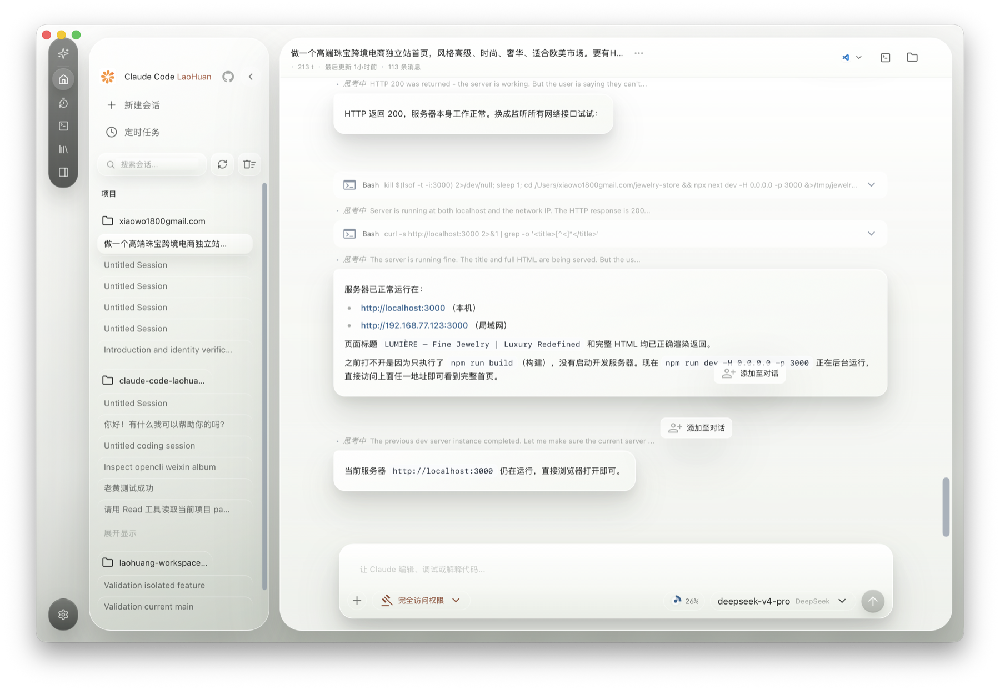

# Claude Code LaoHuang

<p align="right"><strong>中文</strong> | <a href="./README.en.md">English</a></p>

<p align="center">
  
</p>

<p align="center">
  <strong>Claude Code LaoHuang</strong><br>
  本地可运行的 Claude Code 桌面工作台。
</p>

Claude Code LaoHuang 是一个面向本地项目工作的桌面版 AI 编程工作台。它保留 Claude Code 的工具调用、项目上下文和多模型接入能力，并提供更适合日常使用的桌面界面。

当前桌面版支持接入 Anthropic 兼容 API，可配置 MiniMax、DeepSeek、OpenRouter 等 Provider / 模型。

---

## 桌面版预览

下面是 macOS 桌面版 `.app` 的真实工作台截图。界面包含项目侧边栏、会话列表、对话区、工具调用记录、权限模式、模型选择、上下文用量和底部输入区。

<p align="center">
  
</p>

## 下载桌面版

- [macOS Apple Silicon `.dmg`](https://github.com/Ai-LaoHuang/claude-code-laohuang/releases/download/v0.1.0/Claude-Code-LaoHuang_0.1.0_macos_arm64.dmg)
- [Windows x64 安装器 `.exe`](https://github.com/Ai-LaoHuang/claude-code-laohuang/releases/download/v0.1.0/Claude-Code-LaoHuang_0.1.0_windows_x64_setup.exe)
- [v0.1.0 Release 页面](https://github.com/Ai-LaoHuang/claude-code-laohuang/releases/tag/v0.1.0)

macOS 包是 Apple Silicon 本地构建，暂未公证；首次打开时可能需要在系统设置里允许。

macOS DMG SHA256：

```text
f1de4b9b1c8162898a4f26b4f922079242f42a1a99d10b9bf9764e821806f171
```

Windows 安装器 SHA256：

```text
eec6531c177106bdc1943d56b5cac08effa62bc4792407c808e646ed09419b9e
```

## 桌面版亮点

- 原生桌面工作台：侧边栏管理项目和历史会话，主区域承载长对话与工具调用结果。
- 本地项目工作流：可打开项目、打开终端、显示工作区，并围绕当前目录继续编码任务。
- 多 Provider / 模型接入：支持 Anthropic 兼容 API，可配置 MiniMax、DeepSeek、OpenRouter 等模型。
- 权限模式控制：底部输入区可切换访问权限，适合在自动编辑、审查和完全访问之间切换。
- 上下文用量可视化：输入区显示上下文占用，方便观察长对话压力。
- 桌面安装包方案：macOS 已有 `.app` / `.dmg` 构建，Windows 桌面版通过 GitHub Actions 在 Windows runner 上打包 NSIS 安装器。

## 安装包状态

| 平台 | 状态 | 说明 |
|------|------|------|
| macOS Apple Silicon | 已验证 | 本地构建产物为 `.app` 和 `.dmg` |
| Windows x64 | 已配置自动构建 | 使用 GitHub Actions 的 `Build Windows Desktop Installer` workflow 生成桌面版 NSIS `.exe` 安装包 |

Windows 桌面安装器会在安装期处理 WebView2，并检查 Git for Windows；如果依赖安装失败，会给出中文失败原因和手动安装提示。

## 文档入口

- [桌面端使用橙皮书](docs/desktop/orange-book.md)
- [Windows 桌面版安装器说明](docs/desktop/windows-desktop-installer.md)
- [桌面端文档索引](docs/desktop/index.md)
- [当前功能状态](docs/desktop/current-feature-state.md)

## 开发与打包

桌面端代码位于 `desktop/`，主要构建脚本位于 `desktop/scripts/`。

```bash
# macOS Apple Silicon 桌面版构建
cd desktop
bun install
bun run build:macos-arm64
```

```powershell
# Windows x64 桌面安装器构建，需要在 Windows 构建机运行
cd desktop
powershell -ExecutionPolicy Bypass -File ./scripts/build-windows-x64.ps1
```

## 说明

本仓库基于 Claude Code 相关源码做本地可运行修复和桌面化整理，仅供学习、研究和本地实践使用。
