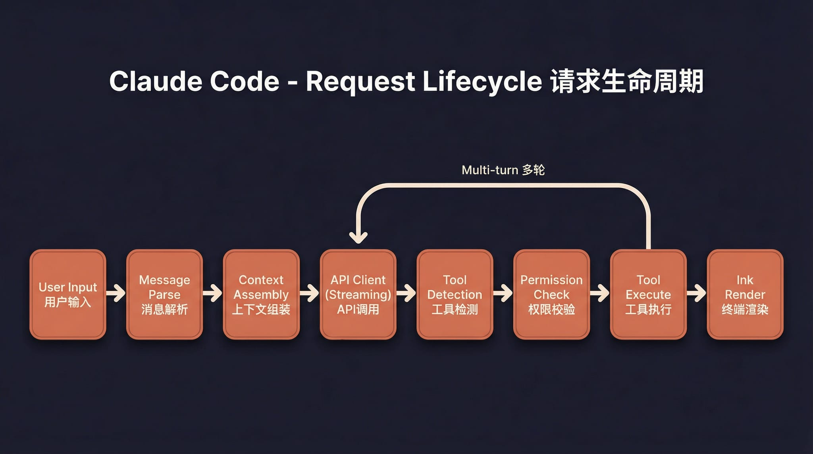
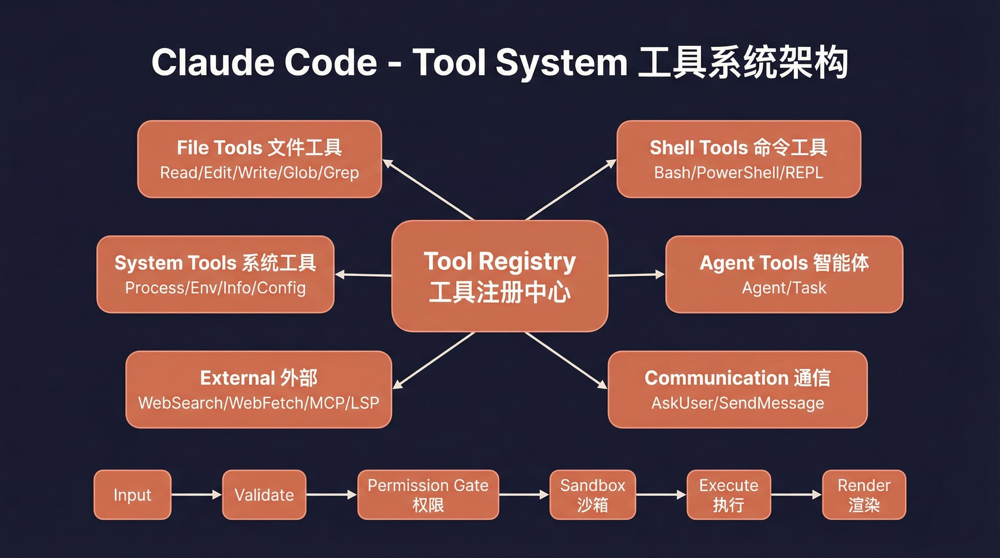

# Claude-code-laohuang

<p align="right"><strong>中文</strong> | <a href="./README.en.md">English</a></p>

<p align="center">
  
</p>

<p align="center">
  <strong>Claude Code LaoHuang</strong><br>
  本地可运行的 Claude Code 桌面工作台与 CLI/TUI 版本。
</p>

基于 Claude-code-laohuang 源码修复的**本地可运行版本**，支持接入任意 Anthropic 兼容 API（如 MiniMax、DeepSeek、OpenRouter 等）。

> 原始泄露源码无法直接运行。本仓库修复了启动链路中的多个阻塞问题，使完整的 Ink TUI 交互界面可以在本地工作。

---

## 桌面版预览

下面是 macOS 桌面版 `.app` 的真实工作台截图。界面包含项目侧边栏、会话列表、对话区、工具调用记录、权限模式、模型选择、上下文用量和底部输入区。

<p align="center">
  
</p>

## 桌面版亮点

- 原生桌面工作台：侧边栏管理项目和历史会话，主区域承载长对话与工具调用结果。
- 本地项目工作流：可打开项目、打开终端、显示工作区，并围绕当前目录继续编码任务。
- 多 Provider / 模型接入：支持 Anthropic 兼容 API，可配置 MiniMax、DeepSeek、OpenRouter 等模型。
- 权限模式控制：底部输入区可切换访问权限，适合在自动编辑、审查和完全访问之间切换。
- 上下文用量可视化：输入区显示上下文占用，方便观察长对话压力。
- 桌面安装包方案：macOS 已有 `.app` / `.dmg` 构建，Windows 桌面版通过 GitHub Actions 在 Windows runner 上打包 NSIS 安装器。
- CLI/TUI 保留：仍可使用完整 Ink TUI、`--print` 无头模式、MCP、插件和 Skills。

## 安装包

当前仓库提供两类构建方式：

| 平台 | 状态 | 说明 |
|------|------|------|
| macOS Apple Silicon | 已验证 | 本地构建产物为 `.app` 和 `.dmg` |
| Windows x64 | 已配置自动构建 | 使用 GitHub Actions 的 `Build Windows Desktop Installer` workflow 生成桌面版 NSIS `.exe` 安装包 |
| CLI/TUI | 可本地运行 | 适合脚本、终端和服务器环境 |

Windows 桌面安装器会在安装期处理 WebView2，并检查 Git for Windows；如果依赖安装失败，会给出中文失败原因和手动安装提示。

详细说明见：[Windows 桌面版安装器说明](docs/desktop/windows-desktop-installer.md) 与 [桌面端使用橙皮书](docs/desktop/orange-book.md)。

---

## CLI/TUI 运行截图

<p align="center">
  
</p>

---

## 架构概览

<table>
  <tr>
    <td align="center" width="25%"><br><b>整体架构</b></td>
    <td align="center" width="25%"><br><b>请求生命周期</b></td>
    <td align="center" width="25%"><br><b>工具系统</b></td>
    <td align="center" width="25%"><br><b>多 Agent 架构</b></td>
  </tr>
  <tr>
    <td align="center" width="25%"><br><b>终端 UI</b></td>
    <td align="center" width="25%"><br><b>权限与安全</b></td>
    <td align="center" width="25%"><br><b>服务层</b></td>
    <td align="center" width="25%"><br><b>状态与数据流</b></td>
  </tr>
</table>

---

## 快速开始

### 1. 安装 Bun

本项目运行依赖 [Bun](https://bun.sh)。如果你的电脑还没有安装 Bun，可以先执行下面任一方式：

```bash
# macOS / Linux（官方安装脚本）
curl -fsSL https://bun.sh/install | bash
```

如果在精简版 Linux 环境里提示 `unzip is required to install bun`，先安装 `unzip`：

```bash
# Ubuntu / Debian
apt update && apt install -y unzip
```

```bash
# macOS（Homebrew）
brew install bun
```

```powershell
# Windows（PowerShell）
powershell -c "irm bun.sh/install.ps1 | iex"
```

安装完成后，重新打开终端并确认：

```bash
bun --version
```

### 2. 安装项目依赖

```bash
bun install
```

### 3. 配置环境变量

复制示例文件并填入你的 API Key：

```bash
cp .env.example .env
```

编辑 `.env`：

```env
# API 认证（二选一）
ANTHROPIC_API_KEY=sk-xxx          # 标准 API Key（x-api-key 头）
ANTHROPIC_AUTH_TOKEN=sk-xxx       # Bearer Token（Authorization 头）

# API 端点（可选，默认 Anthropic 官方）
ANTHROPIC_BASE_URL=https://api.minimaxi.com/anthropic

# 模型配置
ANTHROPIC_MODEL=MiniMax-M2.7-highspeed
ANTHROPIC_DEFAULT_SONNET_MODEL=MiniMax-M2.7-highspeed
ANTHROPIC_DEFAULT_HAIKU_MODEL=MiniMax-M2.7-highspeed
ANTHROPIC_DEFAULT_OPUS_MODEL=MiniMax-M2.7-highspeed

# 超时（毫秒）
API_TIMEOUT_MS=3000000

# 禁用遥测和非必要网络请求
DISABLE_TELEMETRY=1
CLAUDE_CODE_DISABLE_NONESSENTIAL_TRAFFIC=1
```

### 4. 启动

#### macOS / Linux

Mac 也可以直接双击一键安装器：

```bash
Claude-code-laohuang-Mac-一键安装.command
```

```bash
# 交互 TUI 模式（完整界面）
./bin/claude-code-laohuang

# 无头模式（单次问答）
./bin/claude-code-laohuang -p "your prompt here"

# 管道输入
echo "explain this code" | ./bin/claude-code-laohuang -p

# 查看所有选项
./bin/claude-code-laohuang --help
```

### 5. 工具链自检

如果你想确认工具调用能力没有被破坏，可以先跑本地 smoke test。它不需要真实 API Key，会检查内置工具注册、API schema 生成，以及 `Read` / `Glob` / `Grep` 的实际调用：

```bash
bun run smoke:tools
```

看到类似下面的输出就说明基础工具链正常：

```text
tools=25
schemas=ok
read=package.json
glob=5
grep=5
```

#### Windows

> **前置要求**：必须安装 [Git for Windows](https://git-scm.com/download/win)（提供 Git Bash，项目内部 Shell 执行依赖它）。

Windows 下启动脚本 `bin/claude-code-laohuang` 是 bash 脚本，无法在 cmd / PowerShell 中直接运行。请使用以下方式：

**方式一：PowerShell / cmd 直接调用 Bun（推荐）**

```powershell
# 交互 TUI 模式
bun --env-file=.env ./src/entrypoints/cli.tsx

# 无头模式
bun --env-file=.env ./src/entrypoints/cli.tsx -p "your prompt here"

# 降级 Recovery CLI
bun --env-file=.env ./src/localRecoveryCli.ts
```

**方式二：Git Bash 中运行**

```bash
# 在 Git Bash 终端中，与 macOS/Linux 用法一致
./bin/claude-code-laohuang
```

> **注意**：部分功能（语音输入、Computer Use、Sandbox 隔离等）在 Windows 上不可用，不影响核心 TUI 交互。

---

## 环境变量说明

| 变量 | 必填 | 说明 |
|------|------|------|
| `ANTHROPIC_API_KEY` | 二选一 | API Key，通过 `x-api-key` 头发送 |
| `ANTHROPIC_AUTH_TOKEN` | 二选一 | Auth Token，通过 `Authorization: Bearer` 头发送 |
| `ANTHROPIC_BASE_URL` | 否 | 自定义 API 端点，默认 Anthropic 官方 |
| `ANTHROPIC_MODEL` | 否 | 默认模型 |
| `ANTHROPIC_DEFAULT_SONNET_MODEL` | 否 | Sonnet 级别模型映射 |
| `ANTHROPIC_DEFAULT_HAIKU_MODEL` | 否 | Haiku 级别模型映射 |
| `ANTHROPIC_DEFAULT_OPUS_MODEL` | 否 | Opus 级别模型映射 |
| `API_TIMEOUT_MS` | 否 | API 请求超时，默认 600000 (10min) |
| `DISABLE_TELEMETRY` | 否 | 设为 `1` 禁用遥测 |
| `CLAUDE_CODE_DISABLE_NONESSENTIAL_TRAFFIC` | 否 | 设为 `1` 禁用非必要网络请求 |

---

## 降级模式

如果完整 TUI 出现问题，可以使用简化版 readline 交互模式：

```bash
CLAUDE_CODE_FORCE_RECOVERY_CLI=1 ./bin/claude-code-laohuang
```

---

## 相对于原始泄露源码的修复

泄露的源码无法直接运行，主要修复了以下问题：

| 问题 | 根因 | 修复 |
|------|------|------|
| TUI 不启动 | 入口脚本把无参数启动路由到了 recovery CLI | 恢复走 `cli.tsx` 完整入口 |
| 启动卡死 | `verify` skill 导入缺失的 `.md` 文件，Bun text loader 无限挂起 | 创建 stub `.md` 文件 |
| `--print` 卡死 | `filePersistence/types.ts` 缺失 | 创建类型桩文件 |
| `--print` 卡死 | `ultraplan/prompt.txt` 缺失 | 创建资源桩文件 |
| **Enter 键无响应** | `modifiers-napi` native 包缺失，`isModifierPressed()` 抛异常导致 `handleEnter` 中断，`onSubmit` 永远不执行 | 加 try-catch 容错 |
| setup 被跳过 | `preload.ts` 自动设置 `LOCAL_RECOVERY=1` 跳过全部初始化 | 移除默认设置 |

---

## 项目结构

```
bin/claude-code-laohuang # 入口脚本
preload.ts               # Bun preload（设置 MACRO 全局变量）
.env.example             # 环境变量模板
src/
├── entrypoints/cli.tsx  # CLI 主入口
├── main.tsx             # TUI 主逻辑（Commander.js + React/Ink）
├── localRecoveryCli.ts  # 降级 Recovery CLI
├── setup.ts             # 启动初始化
├── screens/REPL.tsx     # 交互 REPL 界面
├── ink/                 # Ink 终端渲染引擎
├── components/          # UI 组件
├── tools/               # Agent 工具（Bash, Edit, Grep 等）
├── commands/            # 斜杠命令（/commit, /review 等）
├── skills/              # Skill 系统
├── services/            # 服务层（API, MCP, OAuth 等）
├── hooks/               # React hooks
└── utils/               # 工具函数
```

---

## 技术栈

| 类别 | 技术 |
|------|------|
| 运行时 | [Bun](https://bun.sh) |
| 语言 | TypeScript |
| 终端 UI | React + [Ink](https://github.com/vadimdemedes/ink) |
| CLI 解析 | Commander.js |
| API | Anthropic SDK |
| 协议 | MCP, LSP |

---

## Disclaimer

本仓库基于 2026-03-31 从 Anthropic npm registry 泄露的 Claude-code-laohuang 源码。所有原始源码版权归 [Anthropic](https://www.anthropic.com) 所有。仅供学习和研究用途。
